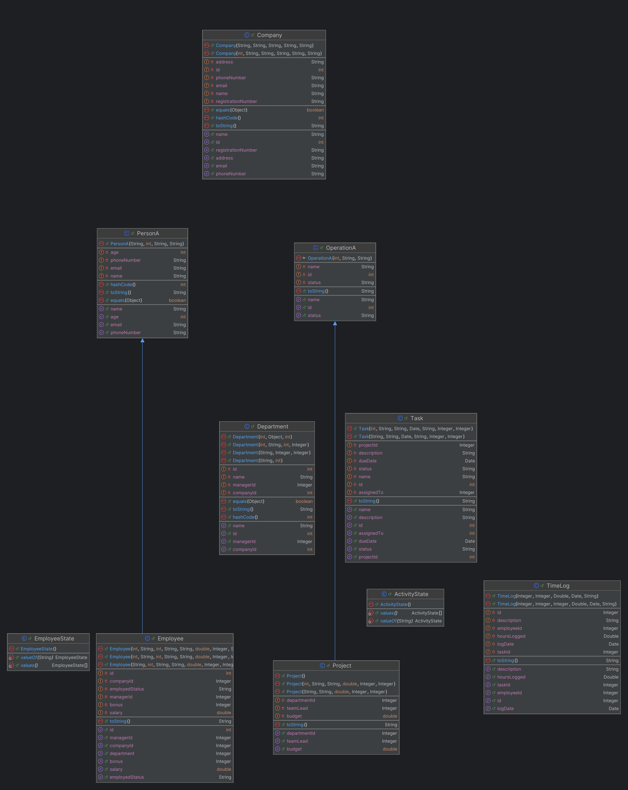
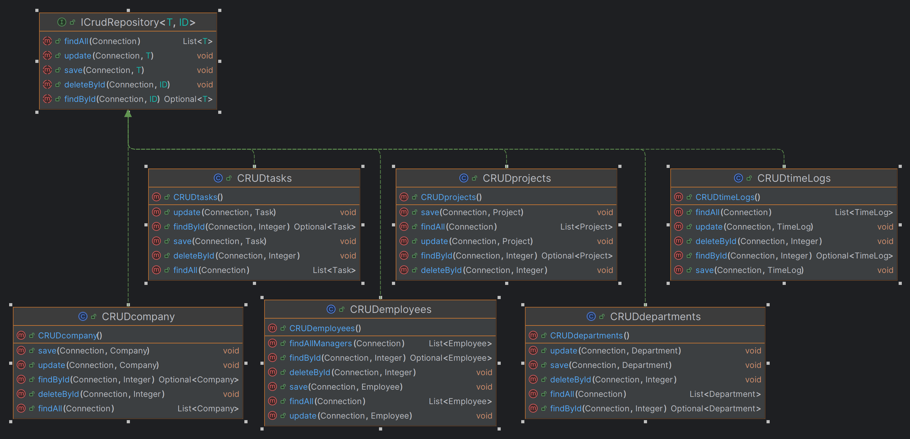
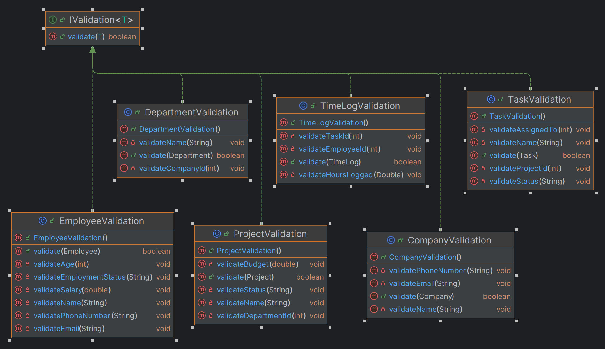
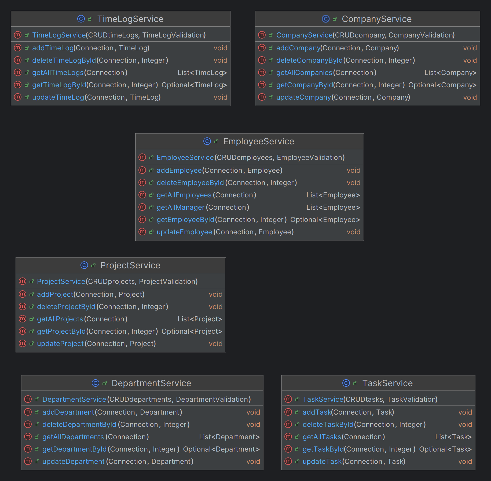
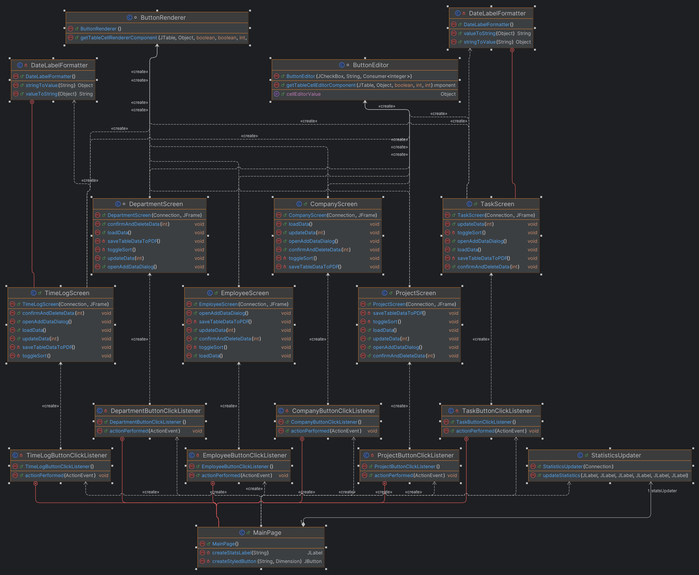

# CRUD Application with Swing Interface and PostgreSQL

This is a Java-based CRUD application with a Swing user interface and a PostgreSQL database. The application allows users to perform Create, Read, Update, and Delete (CRUD) operations on several entities, including companies, departments, employees, projects, tasks, and timelogs. Additionally, users can generate PDF documents containing data from the tables.

## Features

- 📝 **CRUD Operations**: Perform CRUD operations on all tables (company, departments, employees, projects, tasks, timelogs).
- 🖥️ **User Interface**: Intuitive Swing-based GUI for interacting with the database.
- 📄 **PDF Export**: Generate PDF documents containing data from the tables.

## Installation

1. **Clone the repository**:

2. **Set up the database**:
    - Install PostgreSQL.
    - Create a database and run the provided SQL script to set up the schema.

3. **Configure the application**:
    - Update the database configuration in the application (JDBC URL, username, password).

4. **Build and run the application**:
    - Run the .exe file.

## Usage

- **Add, update, delete, and view records**: Use the Swing interface to manage records in the database tables.
- **Export data**: Generate PDF documents with data from the tables using the provided functionality.

## UML Diagrams

### Models

This diagram shows the models used to map the database tables to Java objects.

### CrudRepository

This diagram illustrates the CRUD repository components, providing basic operations for interacting with the database.

### Validations

This diagram outlines the validation components, ensuring that data entered into the application meets certain criteria before being processed.

### Services

This diagram shows the service layer components, responsible for business logic and communication between the repository and the user interface.

### SwingComponents

This diagram details the Swing components used to create the graphical user interface, allowing users to interact with the application.

### Main

This diagram provides an overview of the entire project, showing how all the components are connected and interact with each other.

## Demo Video

Watch the demo video on YouTube:

[https://youtu.be/J4U_DjkSkDU](https://youtu.be/J4U_DjkSkDU)
